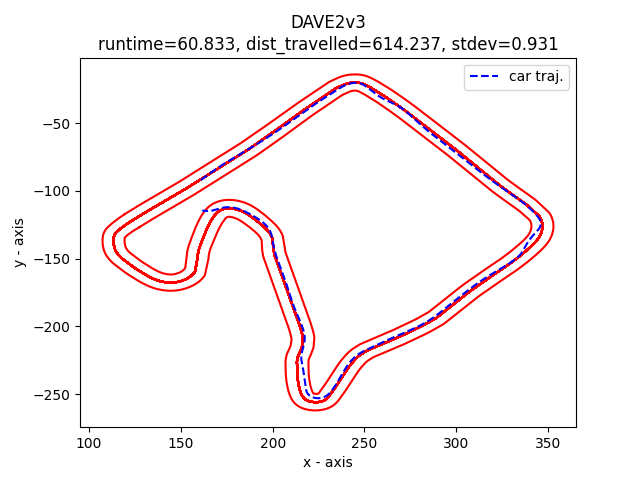
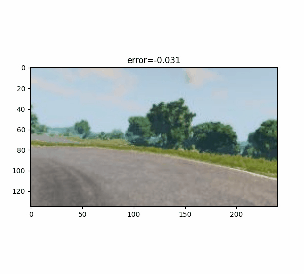

# Fault 1

This DNN was trained on 25,000 samples with data augmentation (noise, flip, blur) using images collected from the track pictured below.
The DNN is then used to navigate the car around this track at 40KPH for straightaways and 30KPH for turns.
When it reaches the only left-hand turn on the track, it takes a right turn instead, leaving the track entirely. 



## Model architecture

```python
DAVE2v3(
  (conv1): Conv2d(3, 16, kernel_size=(3, 3), stride=(3, 3))
  (pool1): MaxPool2d(kernel_size=(2, 2), stride=(2, 2), padding=1, dilation=1, ceil_mode=False)
  (conv2): Conv2d(16, 32, kernel_size=(3, 3), stride=(3, 3))
  (pool2): MaxPool2d(kernel_size=(2, 2), stride=(2, 2), padding=1, dilation=1, ceil_mode=False)
  (conv3): Conv2d(32, 64, kernel_size=(3, 3), stride=(3, 3))
  (pool3): MaxPool2d(kernel_size=(2, 2), stride=(2, 2), padding=1, dilation=1, ceil_mode=False)
  (lin1): Linear(in_features=128, out_features=500, bias=True)
  (dropout1): Dropout(p=0.5, inplace=False)
  (lin2): Linear(in_features=500, out_features=100, bias=True)
  (dropout2): Dropout(p=0.25, inplace=False)
  (lin3): Linear(in_features=100, out_features=20, bias=True)
  (lin4): Linear(in_features=20, out_features=1, bias=True)
)
```

## Test output
