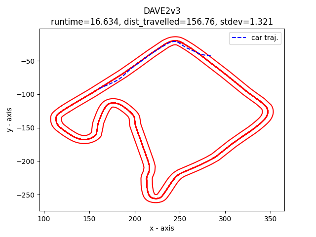
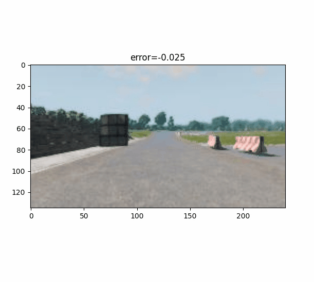
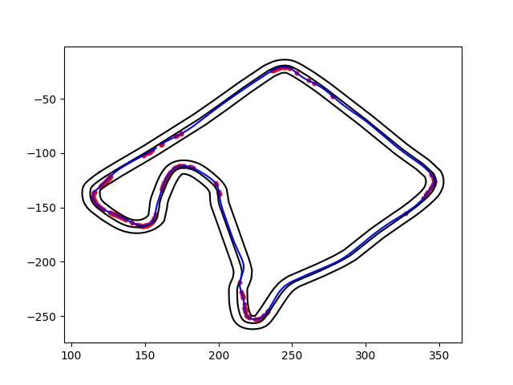

# Fault 2

In this fault, we see the car take a gradual left turn off the road on a straightaway.



This DNN has the same architecture and 3,000 more training samples than the DNN in [Fault 1](../Fault1).
These additional training samples are from a "swerving" dataset to help the DNN learn recovery maneuvers.
Both DNNs are trained with the same data augmentation (noise, flip, blur).


## Model architecture

```python
DAVE2v3(
  (conv1): Conv2d(3, 16, kernel_size=(3, 3), stride=(3, 3))
  (pool1): MaxPool2d(kernel_size=(2, 2), stride=(2, 2), padding=1, dilation=1, ceil_mode=False)
  (conv2): Conv2d(16, 32, kernel_size=(3, 3), stride=(3, 3))
  (pool2): MaxPool2d(kernel_size=(2, 2), stride=(2, 2), padding=1, dilation=1, ceil_mode=False)
  (conv3): Conv2d(32, 64, kernel_size=(3, 3), stride=(3, 3))
  (pool3): MaxPool2d(kernel_size=(2, 2), stride=(2, 2), padding=1, dilation=1, ceil_mode=False)
  (lin1): Linear(in_features=128, out_features=500, bias=True)
  (dropout1): Dropout(p=0.5, inplace=False)
  (lin2): Linear(in_features=500, out_features=100, bias=True)
  (dropout2): Dropout(p=0.25, inplace=False)
  (lin3): Linear(in_features=100, out_features=20, bias=True)
  (lin4): Linear(in_features=20, out_features=1, bias=True)
)
```

## Test output



