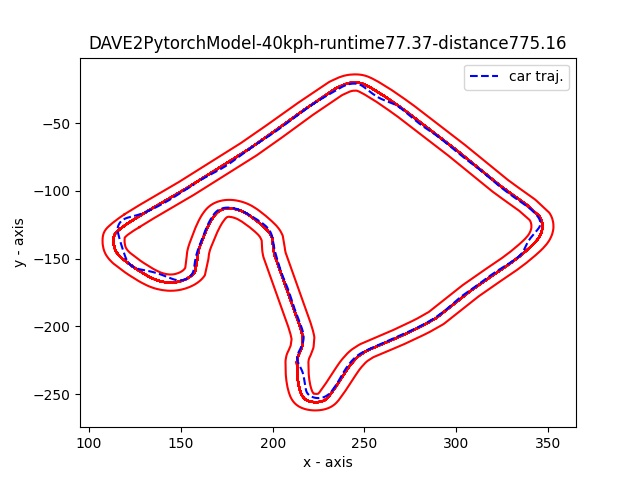
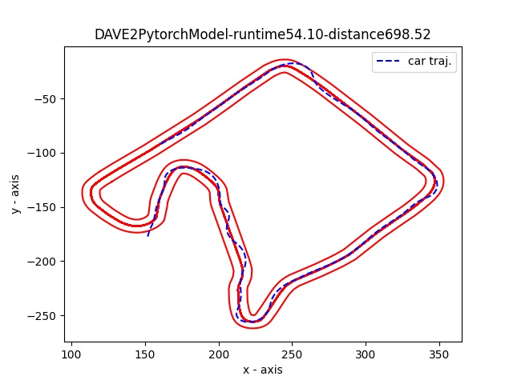
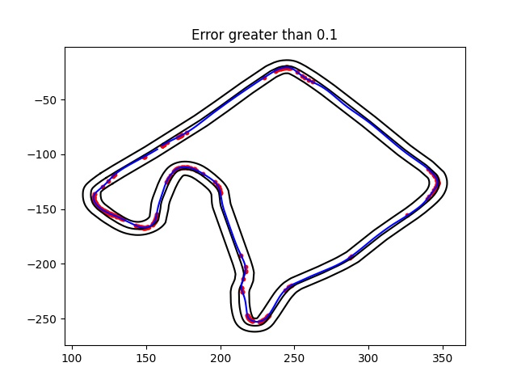
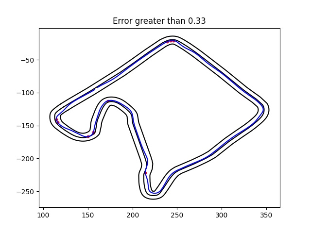
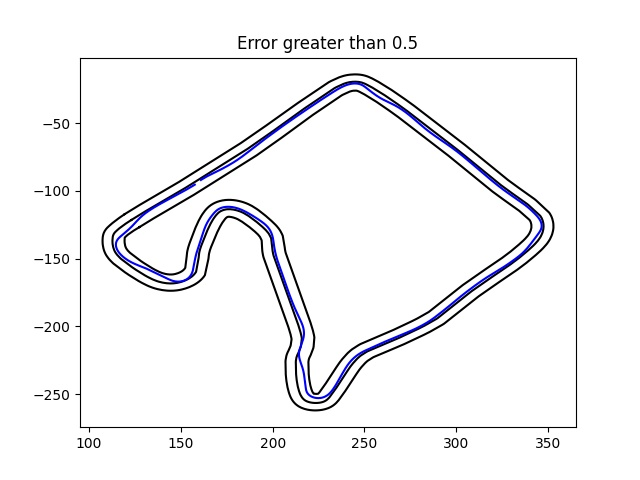

# Fault 3

This DNN was trained on the same dataset using the same robustification measures as the "correct" DNN that produces the expected trajectory.
However, this model has a different architecture that reduces the number of dropout layers from 2 to 1, and does not use `MaxPool2D` layers in between convolutions.
`MaxPool2D` layers are often used to shrink the size of the model, and/or to look for high-value features in a general area of the image, rather than one specific subset of image pixels.
The `MaxPool2D` layers in the "correct DNN" may have improved the generalization of the model.
Without maxpooling, this DNN struggles on an increased speed setpoint from 40KPH to 60KPH (25MPH to 37MPH).

40KPH trajectory:

This closely mirrors the expected trajectory of the "correct" DNN. 
The car struggles more than the "correct" DNN on the last turn, but otherwise the two trajectories are identical.

60KPH trajectory:

The car goes from severely cutting the corners to overshooting them, and recovers poorly from a turn on the 4th straightaway section.
Finally, it fails to make the 2nd-to-last turn, instead running straight off the road.

## Model architecture

```python
DAVE2PytorchModel(
  (conv1): Conv2d(3, 24, kernel_size=(5, 5), stride=(2, 2))
  (conv2): Conv2d(24, 36, kernel_size=(5, 5), stride=(2, 2))
  (conv3): Conv2d(36, 48, kernel_size=(5, 5), stride=(2, 2))
  (conv4): Conv2d(48, 64, kernel_size=(3, 3), stride=(1, 1))
  (conv5): Conv2d(64, 64, kernel_size=(3, 3), stride=(1, 1))
  (dropout): Dropout(p=0.5, inplace=False)
  (lin1): Linear(in_features=14720, out_features=100, bias=True)
  (lin2): Linear(in_features=100, out_features=50, bias=True)
  (lin3): Linear(in_features=50, out_features=10, bias=True)
  (lin4): Linear(in_features=10, out_features=1, bias=True)
)
```

## Test output

The points where the car struggled to maintain the centerline are reflected in the weak points identified in the test output.
In the plot of weakpoints where the error is greater than 0.1, we see the same points where the car recovered poorly on the 4th straightaway.
In the plot of weakpoints where the error is greater than 0.1, we see the same points where the car ran off the road and recovered poorly from the final turn in the 40KPH trajectory.





