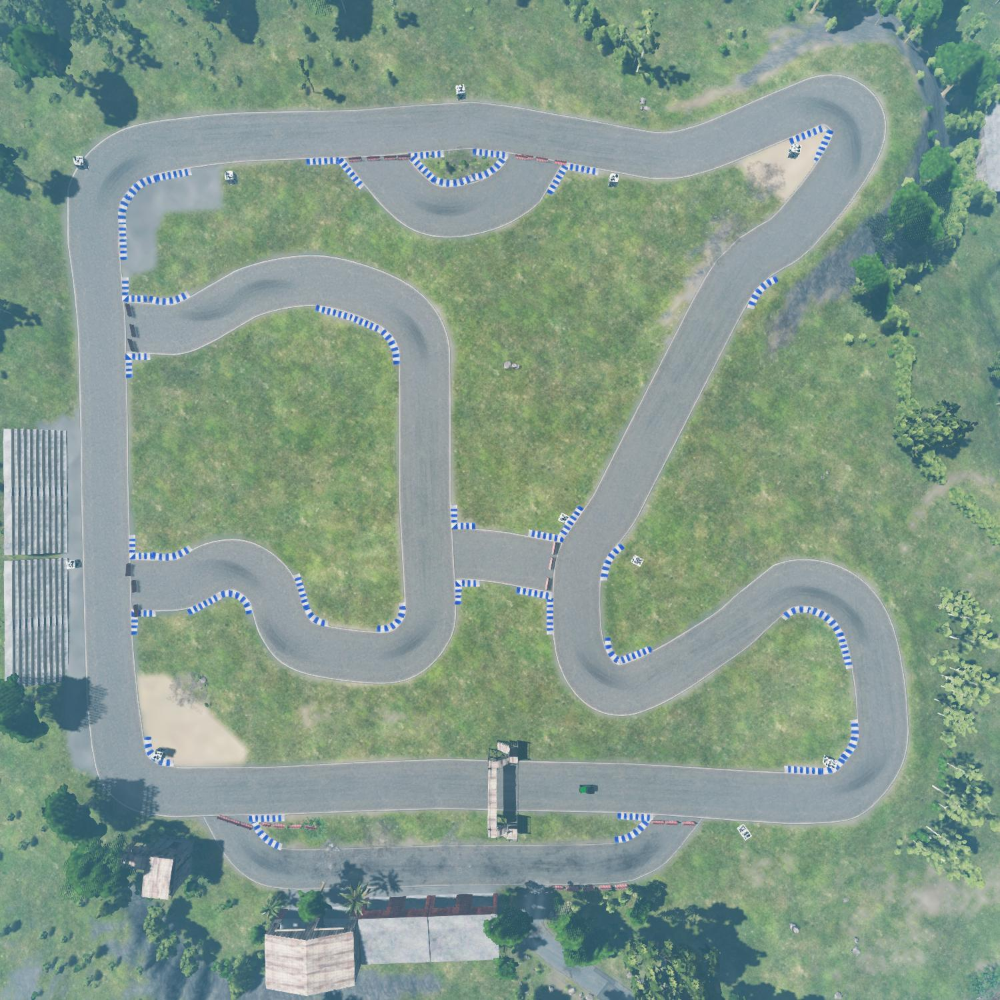

# Defects4DL
Reproducing system-level autonomous driving failures caused by deep learning faults in small test cases

# Faults

The system under test is an autonomous car whose steering is controlled by a DNN.
The DNN is a version of DAVE2. 
Failures were first noticed when controlling the car in the BeamNG driving simulator on a closed track.

Failures are reproduced on a validation set of one lap around this same racetrack. 